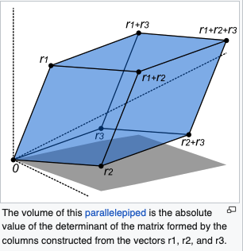

<h1>
    matrix
</h1>
An introduction to Linear Algebra.  

******************  

Summary:
1. [Linear Combination ](#LinearCombination)
2. [Linear Interpolation](#LinearInterpolation)
3. [Dot Product](#DotProduct)
4. [Norm](#Norm)
5. [Cosine](#Cosine)
6. [Cross Product](#CrossProduct)
7. [Linear Map](#LinearMap)
8. [Trace](#Trace)
9. [Transpose](#Transpose)
10. [Row-Echelon form](#Row-Echelonform)
11. [Determinant](#Determinant)
12. [Inverse](#Inverse)
13. [Rank](#Rank)


<div id='LinearCombination'>

<span style="color: green">

## I) **Linear Combination** :

</span>

A linear combination is a mathematical operation that involves **multiplying each element of a
set of values** (usually numbers or vectors) by corresponding coefficients and then summing up the results.

<div id='LinearInterpolation'>


<span style="color: green">

## II) **Linear Interpolation** :

</span>

Linear interpolation is a method for **estimating values between two known values**.
It is a simple and commonly used technique to approximate a value that lies between two data points by assuming a linear relationship between them.

In linear interpolation, you have two known data points (A and B) with values (y_A and y_B) and you want to find the value (y) at some point between A and B.  
Linear interpolation assumes that the relationship between the values is linear, which means that the change in the value is constant as you move from A to B.

<div id='DotProduct'>


<span style="color: green">

## III) **Dot Product**

</span>


The dot product, also known as the scalar product or inner product, is a mathematical operation that **takes two vectors and returns a scalar quantity**.  
It is defined as the ***sum of the products*** of the corresponding components of the two vectors.

### example :  
```
v1 = Vector([4, 2])  
v2 = Vector([2, 1])  
v1.dot(v2) = 4 + 2 + 2 + 1 = 10
```

<div id='Norm'>


<span style="color: green">

## IV) **Norm**

</span>


Think of the "norm" of a vector as a way to measure **how long or short the vector is**.
Imagine you have an arrow (the vector), and you want to know how long it is.
That's what the norm tells you.

Here's how it works:

- If the arrow has no length at all (it's just a dot at a point), its norm is 0.
- If the arrow has some length, you can imagine it as a line. The longer the line, the bigger the norm.
- To calculate the norm, you square the length of each part of the arrow, add all those squared values together, and then take the square root of the result.  

3 Different Norm :  
- **Manhattan distance or Taxicab norm (norm_1)** : It is the shortest distance to go from one point to another.
- **Euclidean Norm (norm)** : the sum of absolute difference of the components of the vectors.
- **infinity norm (norm_inf)** : Gives the largest magnitude among each element of a vector.  
--> Having the vector X= [-6, 4, 2], the L-infinity norm is 6.

<div id='Cosine'>


<span style="color: green">

## V) **Cosine**

</span>

**cosine = (Dot [u, v]) / (Norm[u] Norm[v]);**   --> We use Euclidian norm

For example, if you have a vector v in two-dimensional space and you want to find the cosine of the angle it makes with the x-axis, you can calculate it as:

cos(θ) = (v_x) / ||v||

Where:

θ is the angle between the vector v and the x-axis.
v_x is the x-component of the vector v.
||v|| is the magnitude (norm) of the vector v.
In this context, the cosine of the angle represents how much of the vector's length is aligned with the x-axis. If cos(θ) is 1, it means the vector is parallel to the x-axis. If it's 0, it means the vector is perpendicular to the x-axis. If it's -1, it means the vector is parallel but in the opposite direction of the x-axis.

<div id='CrossProduct'>

<span style="color: green">

## VI) **Cross Product**

</span>

The cross product is a mathematical operation that takes two vectors and produces a third vector **that is perpendicular** (or orthogonal) to the plane formed by the original two vectors. In simpler terms, it gives you a vector that is at a right angle to both of the input vectors.

Here's a simple way to understand it:

Imagine you have two vectors, A and B, in three-dimensional space. The cross product of A and B, denoted as A × B, results in a new vector C.

- The direction of C is perpendicular to the plane formed by vectors A and B.
- The magnitude (length) of vector C depends on the magnitudes of vectors A and B, as well as the angle between them. It is proportional to the sine of the angle between A and B.
- The direction of C follows the right-hand rule: If you curl the fingers of your right hand from vector A toward vector B, your thumb points in the direction of vector C.


<div id='LinearMap'>

<span style="color: green">

## VII) **Linear Map, Matrix multiplication**

</span>

Matrix multiplication is a mathematical operation used to combine two matrices to create a new matrix. In a simple way, you can think of it as a way to mix and match numbers in a structured manner.  
  

Matrix multiplication scales/rotates/skews... a geometric plane  
Same for linear map but with a vector.

<div id='Trace'>

<span style="color: green">

## VIII) **Trace**

</span>

The trace of a square matrix is the sum of its diagonal entries.  


<div id='Transpose'>

<span style="color: green">

## IX) **Transpose**
**
</span>

The transpose of a matrix is a new matrix whose rows are the columns of the original.


<div id='Row-Echelonform'>

<span style="color: green">

## X) **Row-Echelon form**

</span>

The row-echelon form (or row echelon form) of a matrix is a special form used in linear algebra that **simplifies the process of solving linear equations** and performing various matrix operations. Its primary purpose is to make it easier to analyze and manipulate matrices for tasks like solving systems of linear equations, finding matrix inverses, and determining the rank of a matrix.

Row echelon form :
- **Leading Entries**: In each row of the matrix, the first nonzero element (from the left) is called a "leading entry," and it must be strictly to the right of the leading entry in the row just above it.
- **Zero Rows**: Any rows consisting entirely of zeros are placed at the bottom of the matrix.
- **Columns of Leading Entries**: The columns containing the leading entries must form a sequence of consecutive columns.  
In other words, there should be no columns between two leading entries.
- **Leading Entries are 1**: Each leading entry must be equal to 1, which means that if a row contains a leading entry, it should be divided by that leading entry to make it 1.
- **Leading Entry Column Zeros**: All entries below and above a leading entry must be zeros.
- **Leading Entry Rows Sorted**: Rows with all zeros should be placed at the bottom, and the rows with leading entries should be ordered so that the leading entry in each row is to the right of the leading entry in the row just above it.

- 1) num_rows, num_cols = len(self.data), len(self.data[0]): This line calculates the number of rows and columns in the matrix self.  
It uses the len function to determine the length of self.data, which represents the rows, and the length of self.data[0], which represents the number of columns.
- 2) row = 0: Initialize a variable row to keep track of the current row during the row echelon form transformation.  
It starts at the first row (index 0).
- 3) The method enters a loop that iterates over each column (col) from left to right.
- - - a. if row >= num_rows:: This condition checks whether we have processed all rows.  
If row is greater than or equal to the total number of rows (num_rows), it means we have completed the transformation for all rows, so the loop is exited using break.
- - - b. pivot_row = row: Initialize pivot_row to the current row row.
- - - c. while pivot_row < num_rows and self.data[pivot_row][col] == 0:: This loop searches for the first non-zero element in the current column (col). It keeps incrementing pivot_row until it finds a non-zero element or until it reaches the end of the matrix (num_rows).  
If it finds a non-zero element, the loop exits.
- - - d. if pivot_row == num_rows:: If the loop in step c didn't find a non-zero element in the current column, this condition checks if we've reached the end of the matrix (num_rows) without finding a non-zero element.  
If so, it means the column is all zeros, and we move to the next column by using continue, skipping the remaining code for the current column.
- - - e. self.swap_rows(pivot_row, row): If we found a non-zero element, we swap the rows to make this non-zero element the leading 1 (pivot element). This helps in creating the row echelon form. The swap_rows method is assumed to correctly swap the rows.
- - - f. pivot_element = self.data[row][col]: The pivot_element variable is assigned the value of the leading 1 (pivot element) in the current row (row) and current column (col).
- - - g. self.data[row] = [round(x / pivot_element, decimal_places) for x in self.data[row]]: We divide the entire row (self.data[row]) by the pivot_element to make it equal to 1. The round function is used to round each element in the row to the specified number of decimal places (decimal_places).
- - - h. Next, we eliminate other rows by subtracting multiples of the current row from them. This ensures that the leading 1 in the current column is the only non-zero element in that column.
- - - i. The loop variable row is incremented to move to the next row.
- 4) After processing all columns and rows, the method returns self, which now contains the matrix in row echelon form.  


<div id='Determinant'>

<span style="color: green">

## XI) **Determinant**

</span>

Purpose: The determinant can tell you two important things:

- **Area or Volume Scaling**: If you think of the matrix as a set of vectors that describe how to stretch, shrink, or flip an area (in 2D) or a volume (in 3D), the determinant tells you how much the area or volume scales.  
A positive determinant means it stretches or shrinks, while a negative determinant means it flips.

- **Matrix Inversibility**: If the determinant is not zero, it tells you that the matrix is invertible, which means you can find another matrix (the inverse) that, when multiplied with the original matrix, gives you the identity matrix. In simpler terms, it helps determine if you can "undo" the matrix operations.  


  

<div id='Inverse'>

<span style="color: green">

## XII) **Inverse**

</span>

```
A^-1 == 1 / A
AA-1 = A^-1 * A = I

I :
- It is "square" (has same number of rows as columns),
- It has 1s on the diagonal and 0s everywhere else.
- Its symbol is the capital letter I.
```

The Inverse Matrix Method is a coveted topic in the realm of linear algebra.    
The inverse of a matrix, labelled as 
, is the highly unique matrix that, when multiplied with the original matrix (A), results in the identity matrix (I).  

This seems simplistic, but the depth of this concept is profound.
The Identity matrix ot 'I', by definition, is a special square matrix with ones on its main diagonal and zeros elsewhere. Applying the inverse matrix method allows us to find solutions to complex linear systems.  


<span style="color: green">

<div id='Rank'>

## XIII) **Rank**

</span>

The rank of a matrix is the number of linearly independent rows or columns in the matrix.  

